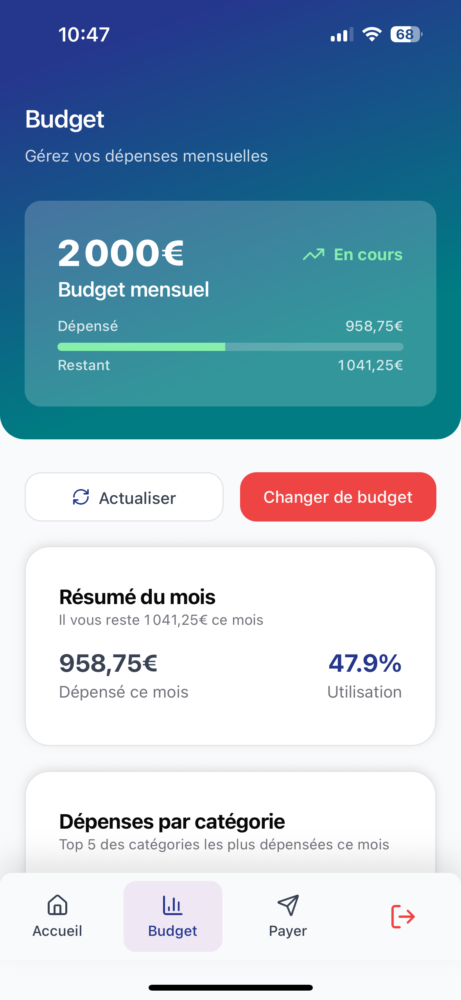

# CIC Pulse 👨🏼‍💻

**A payment and budget management application for young adults**

<div style="text-align: center;">

</div>

## Project Context

This is a **school project** simulating a response to a call for tender from CIC bank. The objective was to build a **Proof of Concept (POC)** within one week to demonstrate the feasibility of the proposed solution.

### Initial Brief

CIC Pulse is a mobile-first banking application designed specifically for young adults (18-30 years old), created to compete with modern neobanks like Lydia, Revolut, and Pixpay. This project represents CIC's digital transformation initiative to attract the digitally-native Generation Z audience.

The application focuses on:
- **Peer-to-peer payments** - Send money between friends seamlessly
- **Personalized budget management** - Track expenses and manage finances
- **Modern banking experience** - Reimagined banking relationship for Gen Z
- **Gamification** - Interactive features to engage users
- **Expense sharing** - Split bills and shared expenses with contacts

CIC Pulse offers a complementary experience to the traditional CIC banking app, with a fluid, friction-free mobile experience inspired by popular apps like Snapchat, Spotify, TikTok, and Lydia.

## Tech Stack

- **Backend**: AdonisJS (Node.js)
- **Mobile**: Expo (React Native)
- **Database**: PostgreSQL/MySQL (configurable)
- **Development**: Docker DevContainer support

## Architecture

This is a **monorepo** containing:
- **API** - Built with AdonisJS (Node.js framework)
- **Mobile App** - Built with Expo (React Native)

## Getting Started

### Prerequisites

- A Docker runtime (for devcontainer support)

### Installation

1. Clone the repository:
```bash
git clone git@github.com:tdusautoir/ecv-pulse.git
cd ecv-pulse
```

2. Make sure you have Docker installed and open the project in a compatible editor like Visual Studio Code. The devcontainer will automatically set up the development environment for you.

```bash
# start the api
cd api

# setup database
nano .env 
node ace migration:run
node ace db:seed

# start the expo app
cd ../app
yarn start
```

### Login into CIC Pulse

> [!WARNING]
> You must have the API running

If you want to login into an account within your expo app, you simply need to register a user

```bash
# register a user
curl -X POST http://localhost:3333/register \
  -H "Content-Type: application/json" \
  -d '{
    "fullName": "Test User",
    "email": "user@example.com",
    "phoneNumber": "+33781686058",
    "password": "your-secret-password"
  }'
```
 
You can now login with those credentials:

- **Email**: user@example.com
- **Password**: your-secret-password

## App Screenshots

<div style="display: flex; flex-wrap: wrap; gap: 20px;">




</div>
